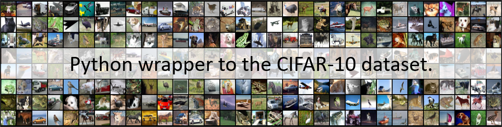

# CIFAR-10

<p align="center"></p>

## Usage
As simple as:
```python
from cifar import CIFAR10

# Instantiate the dataset. If the dataset is not found in `dataset_root`,
#  the first time it is automatically downloaded and extracted there.
dataset = CIFAR10(dataset_root='./cifar10')
```
and you're done.

## Why this wrapper?

The [CIFAR-10 dataset](https://www.cs.toronto.edu/~kriz/cifar.html) consists of 60000 32x32 colour images in 10 classes, with 6000 images per class. It's kind of famous in the computer vision community and it is often used as (toy) benchmark.

Despite it's quite famous, I did not find any easy plug-and-play wrapper around it. Of course, there are wrappers to CIFAR-10 in most deep learning frameworks ([TensorFlow](https://github.com/tensorflow/models/tree/master/tutorials/image/cifar10), [PyTorch](https://pytorch.org/docs/stable/torchvision/datasets.html)) but you know I usually don't want to get into a whole deep learning framework just to play with 32x32 cat images. So here's why.

## Installation

* *No installation required.* You can just clone / download / copypaste this repository.
* I'm wondering if it might be useful to add it to PyPI...

## Requirements
* Python >= 3.6

## Hello World
```python
from cifar import CIFAR10

# Instantiate the dataset. If the dataset is not found in `dataset_root`,
#  the first time it is automatically downloaded and extracted there.
dataset = CIFAR10(dataset_root='./cifar10')

# That's it. Now all examples are in `dataset.samples` dictionary. There
#  are 50000 train examples and 10000 test examples.
print(dataset.samples['train'].shape)           # (50000,)
print(dataset.samples['test'].shape)            # (10000,)

# Each example is constituted by a 32x32 RGB image and its
#  corresponding label, both numeric and human readable.
print(dataset.samples['train'][0].image.shape)  # (32, 32, 3)
print(dataset.samples['train'][0].label)        # 6
print(dataset.samples['train'][0].label_hr)     # frog
print(dataset.samples['train'][0].filename)     # leptodactylus_pentadactylus_s_000004.png

# You can also directly print the example
print(dataset.samples['train'][0])              # [frog] - leptodactylus_pentadactylus_s_000004.png

# You can convert the CIFARSamples to ndarray. Images are possibly flattened
#  and/or normalized to be centered on zero (i.e. in range [-0.5, 0.5])
x_train, y_train = CIFAR10.to_ndarray(dataset.samples['train'], normalize=True, flatten=True)
x_test, y_test = CIFAR10.to_ndarray(dataset.samples['test'], normalize=True, flatten=True)

print(x_train.shape, y_train.shape)             # (50000, 3072)  (50000,)
print(x_test.shape, y_test.shape)               # (10000, 3072)  (10000,)
```


